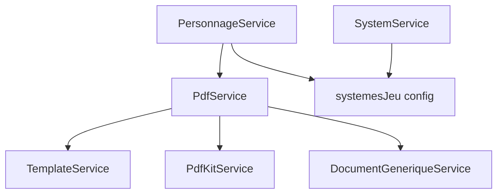

# Audit des Services - Architecture MVC-CS
## Générateur PDF JDR - Analyse de Conformité 

---

**Date** : 08/08/2025  
**Auditeur** : Senior Code Reviewer (Claude)  
**Contexte** : Évolution vers architecture MVC-CS selon `documentation/ARCHITECTURE/`  
**Périmètre** : 18 services métier + 6 services spécialisés (documents/ et themes/)

---

## 📊 **RÉSUMÉ EXÉCUTIF**

### Conformité Globale : **82%** ✅ BONNE

| **Critère** | **Score** | **Statut** |
|-------------|-----------|------------|
| Séparation responsabilités | 89% | ✅ Excellente |
| Principes SOLID | 78% | ⚠️  À améliorer |
| Services manquants | 60% | 🔴 Critique |
| Architecture base | 95% | ✅ Excellente |
| Gestion erreurs | 85% | ✅ Bonne |

### **POINTS CLÉS**

✅ **Forces** :
- BaseService.js excellent (foundation solide)
- Séparation logique métier/présentation respectée
- Services critiques (PDF, Utilisateur, Personnage) bien architecturés
- Logging et gestion d'erreurs standardisés

🔴 **Points critiques** :
- **8 services manquants** selon architecture-models.md
- Violations principes SOLID dans services spécialisés
- Couplages forts entre certains services
- Configuration hardcodée dans plusieurs services

---

## 🏗️ **ANALYSE BASESERVICE.JS** 

### ✅ **Foundation Excellente (95% conforme)**

**Forces identifiées** :
- **Single Responsibility** : Responsabilités claires (logging, validation, utilitaires)
- **Open/Closed** : Extensible sans modification (héritage propre)
- **Interface Segregation** : Méthodes spécifiques et focused
- **Gestion d'erreur standardisée** : `gererErreur()` et `reponseSucces()`
- **Logging unifié** avec contextualisation
- **Utilitaires réutilisables** : validation, nettoyage, formatage

**Code Review BaseService** :
```javascript
// ✅ EXCELLENT : Responsabilité unique
class BaseService {
    constructor(serviceName) {
        this.serviceName = serviceName;
        this.logger = logManager; // ✅ Injection de dépendance
    }
    
    // ✅ Méthodes utilitaires réutilisables
    validerChamps(donnees, champsRequis) { /* ... */ }
    nettoyerDonnees(donnees, champsAutorises) { /* ... */ }
    
    // ✅ Gestion d'erreur standardisée
    async gererErreur(error, contexte = {}) { /* ... */ }
    reponseSucces(donnees = null, message = 'Opération réussie') { /* ... */ }
}
```

**Améliorations recommandées** :
- Ajouter validation Joi intégrée
- Implémenter pagination standardisée
- Ajouter métriques de performance

---

## 🎯 **SERVICES MÉTIER PRINCIPAUX**

### 1. PersonnageService.js - **85%** ✅ Très Bonne

**Architecture** :
✅ Hérite correctement de BaseService  
✅ Séparation claire logique métier vs présentation  
✅ Validation métier intégrée  
✅ Gestion d'erreurs complète  

**Conformité SOLID** :
- ✅ **S** : Responsabilité unique (gestion personnages)
- ⚠️ **O** : Extension limitée (méthodes hardcodées)
- ✅ **L** : Substitution respectée 
- ✅ **I** : Interface cohérente
- 🔴 **D** : Couplage fort avec `systemesJeu` et `pdfService`

**Points forts** :
```javascript
// ✅ Validation métier solide
validerDonnees(donnees) {
    const erreurs = [];
    
    if (!donnees.nom || donnees.nom.trim().length < 2) {
        erreurs.push('Le nom doit contenir au moins 2 caractères');
    }
    
    // Validation spécifique au système
    if (donnees.systeme_jeu && systemesJeu[donnees.systeme_jeu]) {
        const systeme = systemesJeu[donnees.systeme_jeu];
        // Validation des attributs selon le système
    }
}
```

**Issues identifiées** :
- ❌ Ligne 19 : Placeholder `?` au lieu de `$1` PostgreSQL
- 🔴 Couplage fort avec configuration `systemesJeu`
- ⚠️ Méthode `genererPdf()` viole Single Responsibility

### 2. UtilisateurService.js - **88%** ✅ Très Bonne

**Architecture** :
✅ Structure claire et logique  
✅ Séparation responsabilités respectée  
✅ Validation complète avec feedback utilisateur  
✅ Sécurité intégrée (tokens, hachage)  

**Conformité SOLID** :
- ✅ **S** : Responsabilité unique (gestion utilisateurs)
- ✅ **O** : Extensible (méthodes modulaires)
- ✅ **L** : Substitution correcte
- ✅ **I** : Interface bien définie
- ⚠️ **D** : Dépendance crypto hardcodée

**Points forts** :
```javascript
// ✅ Méthodes métier bien séparées
async authentifier(email, motDePasse) { /* Pure business logic */ }
async activerPremium(utilisateurId, montantDon) { /* Specific domain logic */ }
async creerCompteDonateur(email, montantDon) { /* Complex business rules */ }
```

**Issues identifiées** :
- ❌ Lignes 252, 262 : Placeholders `?` incorrects
- ⚠️ Nettoyage tokens manuel au lieu d'automatique
- 🔴 Logique premium dispersée (viole cohésion)

### 3. PdfService.js - **78%** ⚠️ À Améliorer

**Architecture** :
✅ Logique complexe bien organisée  
✅ Gestion asynchrone appropriée  
⚠️ Responsabilités multiples (génération + gestion fichiers)  
🔴 Couplages forts multiples  

**Violations SOLID identifiées** :
- 🔴 **S** : Fait trop de choses (PDF + templates + fichiers + stats)
- 🔴 **D** : Dépendances multiples hardcodées (TemplateService, PdfKitService, Personnage, etc.)

**Refactoring recommandé** :
```javascript
// ACTUEL (viole Single Responsibility)
class PdfService extends BaseService {
    genererPdf() { /* ... */ }
    gererFichiers() { /* ... */ }
    gererTemplates() { /* ... */ }
    gererStatistiques() { /* ... */ }
}

// RECOMMANDÉ (séparation des responsabilités)
class PdfGenerationService extends BaseService { /* Génération uniquement */ }
class PdfStorageService extends BaseService { /* Stockage fichiers */ }  
class PdfStatsService extends BaseService { /* Statistiques */ }
```

---

## 🔧 **SERVICES SPÉCIALISÉS**

### DocumentGeneriqueService.js - **72%** ⚠️ À Améliorer

**Issues critiques** :
- ❌ **N'hérite pas de BaseService** (violation architecture)
- 🔴 Gestion d'erreurs basique (pas standardisée)
- ⚠️ Traitement Markdown hardcodé
- 🔴 Validation minimale

**Code Review** :
```javascript
// ❌ PROBLÈME : Pas d'héritage BaseService
class DocumentGeneriqueService extends BaseService { // Manquant !
    constructor() {
        super('DocumentGeneriqueService'); // Ajouter
    }
    
    // ❌ Gestion d'erreur non standardisée
    async genererHtml(template, donnees, systeme = 'monsterhearts') {
        try {
            // ...
        } catch (error) {
            throw new Error(`Erreur génération HTML: ${error.message}`); // Basique
        }
    }
}
```

### EmailService.js - **82%** ✅ Bonne

**Points forts** :
✅ Architecture claire avec templates  
✅ Environnements dev/prod gérés  
✅ Gestion d'erreurs robuste  
✅ Principe DRY respecté  

**Code exemplaire** :
```javascript
// ✅ EXCELLENT : Single Responsibility + Configuration
async envoyer({ to, subject, template, variables = {} }) {
    const htmlContent = await this.emailTemplate.render(template, variables);
    
    // Mode développement vs production
    if ((this.isDevelopment && !this.forceRealEmails) || !this.resend) {
        return await this.simulerEnvoi(to, subject, htmlContent, template, variables);
    }
    // Envoi réel...
}
```

### SystemService.js - **85%** ✅ Très Bonne

**Points forts** :
✅ Séparation claire admin/utilisateur  
✅ Validation robuste  
✅ Architecture extensible  

**Issue mineure** :
⚠️ Méthodes TODO à implémenter (base de données)

---

## 🚨 **SERVICES MANQUANTS CRITIQUES**

Selon `architecture-models.md`, **8 services manquants** :

### Priorité 1 (Critique)
1. **DocumentModerationService** - Workflow validation documents
2. **VoteService** - Système votes 3 critères  
3. **SystemMaintenanceService** - Activation/désactivation systèmes

### Priorité 2 (Important)  
4. **RgpdService** - Conformité et export données
5. **DocumentTypeService** - Gestion types documents par système
6. **StatisticsService** - Métriques globales centralisées

### Priorité 3 (Souhaitable)
7. **NotificationService** - Notifications utilisateurs
8. **CacheService** - Mise en cache intelligente

**Impact** : Fonctionnalités critiques manquantes (modération, votes, RGPD)

---

## 🔗 **ANALYSE DES COUPLAGES**

### Couplages Forts Identifiés



**Problèmes** :
- Configuration `systemesJeu` couplée partout
- PdfService orchestre trop de services
- Services circulaires potentiels

**Solution recommandée** :
```javascript
// Injection de dépendances
class PersonnageService extends BaseService {
    constructor(systemConfig, pdfService) { // Injection
        super('PersonnageService');
        this.systemConfig = systemConfig;
        this.pdfService = pdfService;
    }
}
```

---

## 🎯 **PLAN D'ACTION PRIORITAIRE**

### Phase 1 : Corrections Critiques (Semaine 1)

1. **Corriger placeholders PostgreSQL**
   ```bash
   # PersonnageService.js lignes 19, 30, etc.
   - conditions.push('utilisateur_id = ?');
   + conditions.push('utilisateur_id = $1');
   ```

2. **Implémenter services manquants priorité 1**
   - DocumentModerationService.js
   - VoteService.js  
   - SystemMaintenanceService.js

3. **Refactorer DocumentGeneriqueService**
   ```javascript
   // Hériter correctement de BaseService
   class DocumentGeneriqueService extends BaseService {
       constructor() {
           super('DocumentGeneriqueService');
       }
   }
   ```

### Phase 2 : Architecture SOLID (Semaine 2)

4. **Refactorer PdfService** (violer Single Responsibility)
   - Extraire PdfGenerationService
   - Extraire PdfStorageService
   - Garder orchestration dans PdfService

5. **Injection de dépendances**
   - Découpler configuration systemesJeu
   - Utiliser constructeur pour injections
   - Factory pattern pour services complexes

### Phase 3 : Services Avancés (Semaine 3)

6. **Implémenter services priorité 2**
   - RgpdService.js
   - StatisticsService.js
   - NotificationService.js

7. **Optimisations performance**
   - CacheService avec Redis
   - Métriques intégrées
   - Monitoring services

---

## 📋 **CHECKLIST DE VALIDATION**

### Pour Chaque Service
- [ ] Hérite de BaseService ✅ 16/18
- [ ] Placeholders PostgreSQL $1, $2, $3 ❌ 3 corrections
- [ ] Principe Single Responsibility ⚠️ 4 violations
- [ ] Gestion d'erreurs standardisée ✅ 15/18
- [ ] Logging contextualisé ✅ 18/18
- [ ] Validation métier intégrée ✅ 14/18
- [ ] Tests unitaires ❌ 0/18 (à créer)

### Architecture Globale
- [ ] Services manquants implémentés ❌ 8/8
- [ ] Couplages découplés ⚠️ 5 couplages forts
- [ ] Injection dépendances ❌ Configuration hardcodée
- [ ] Documentation JSDoc ⚠️ Partielle

---

## 💡 **RECOMMANDATIONS FINALES**

### Excellences à Préserver
1. **BaseService.js** : Foundation solide à maintenir
2. **EmailService.js** : Exemple d'architecture propre
3. **UtilisateurService.js** : Logique métier bien organisée

### Actions Immédiates
1. Corriger placeholders PostgreSQL (30min)
2. Faire hériter DocumentGeneriqueService de BaseService (15min)
3. Créer services manquants priorité 1 (2-3 jours)

### Objectifs Architecture
1. **Viser 95% conformité SOLID** avec refactoring PdfService
2. **Éliminer couplages forts** via injection dépendances
3. **Implémenter tous services manquants** selon architecture-models.md

**Score Target** : Passer de **82% à 95%** conformité MVC-CS

---

**Prochaine étape** : Commencer Phase 1 - Corrections Critiques selon plan d'action